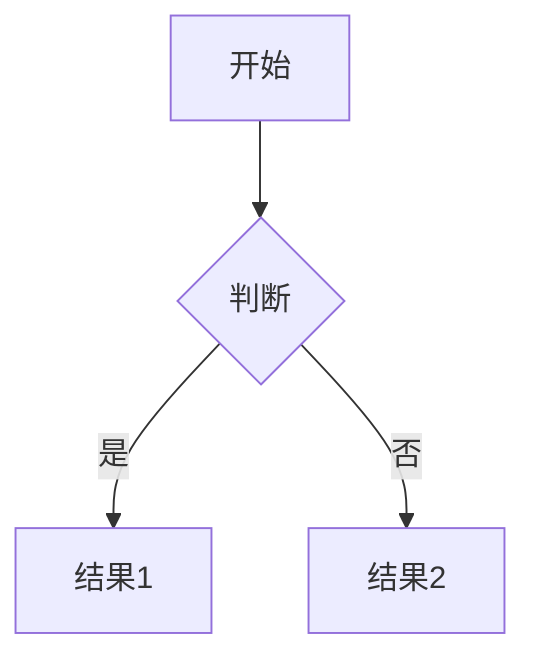

# 📘 Slidev 项目完整工作规约

## 🎯 项目上下文

- 在每次对话前，**必须加载**：
  - `.trae/project_rules.md`：包含技术选型、命名规范、模块结构、可复用组件、主题配置、布局、图标使用、幻灯片结构等关键规范。
  - `.trae/memory_bank/*`：记录开发状态、API定义、进展和设计上下文。

- 若`.trae/project_rules.md`不存在，应自动创建并初始化内容，包含：
  - 技术栈选型（Vue3 + Slidev + Vite）；
  - 命名规范、目录结构；
  - 图标使用准则；
  - 设计系统及可复用UI组件规范。

## 🧭 项目目标与风格

- 每页幻灯片聚焦一个核心思想，避免信息过载。
- 内容语言：**简体中文**。
- 演示节奏应与讲解速度匹配，方便观众理解并互动。

## 🧱 幻灯片结构

- **标题页**：`#` 作为章节或话题的分隔符。
- **内容页**：`##` 二级标题配合列表展示核心点。
- **代码页**：使用代码块并指定语言。
- **图表页**：支持插入图片、Mermaid流程图。
- **总结页**：回顾本节要点。

**布局选择**：
- 使用内置布局（cover、default、center、image-left/right、iframe-left/right、quote、section、two-cols 等），在幻灯片 frontmatter 中指定：

  ```yaml
  ---
  layout: image-left
  image: /path/to/image.png
  ---
  ```

- 当内置布局无法满足需求，可在项目`layouts/`目录自定义Vue布局组件并通过frontmatter引用。

**布局加载优先级**：
1. 内置布局；
2. 主题提供的布局；
3. 插件/附加提供的布局；
4. `layouts/`中的自定义布局。

## 🎨 设计系统

- 必须同时支持**浅色和深色主题**，以满足不同环境下的可读性与美观需求。
- 使用 UnoCSS + CSS变量 定义主题色，并在 `uno.config.ts` 配置：

```typescript
export default defineConfig({
	presets: [
	  presetUno({
	    dark: 'class',
	  }),
	],
})
```

- 通过 `<html class="dark">` 或 `<html class="">` 切换主题。

**Slidev主题元数据**：
在`package.json`中声明主题支持的颜色方案：

```json
{
  "slidev": {
    "colorSchema": "both"
  }
}
```

**设计Token**示例：

```markdown
## Colors
- Primary: `--color-primary`
- Background: `--color-background`
- Text: `--color-text`

## Typography
- Font Family: `--font-family`
- Font Size: `--font-size-base`
```

组件应使用CSS变量适配当前主题。

## 🧩 可复用UI组件

- 组件需放置于`components/`目录，符合Slidev自动注册规范：

```
slidev/
├── components/
│ ├── MyComponent.vue
│ └── AnotherComponent.vue
```

- 组件命名使用 PascalCase，例如 `MyComponent.vue`。
- 在`.vue`文件中用HTML注释写明用途和使用示例：

```vue
<!--
Component: MyComponent
Description: 显示带有可自定义消息的提示框。
Usage: <MyComponent type="success" message="操作成功" />
-->
```

- 组件设计原则：
  - 高内聚、单一职责、可定制（支持props和slots）。
  - 样式使用 UnoCSS 工具类或在`<style>`中定义。
- 一旦组件放置到`components/`目录，可在Markdown中直接使用：

```markdown
<MyComponent type="warning" message="请先阅读指南。" />
```

## 🧠 Memory Bank 机制

- 所有开发信息需同步更新到`memory-bank/`下各文件中，包括：
  - `globalContext.md`、`activeContext.md`、`progress.md`、`slidesContext.md`等。
- 每次对话前：
  - **强制**读取 `memory-bank/attention.md` 获取特殊需求。
  - 比较当前进展与Memory Bank差异，并在`progress.md`中记录更新日志。

## 🛠️ 技术内容规范

- **代码示例**：必须指定语言类型并包含注释解释用途。
- **流程描述**：可用有序列表或Mermaid图表示。
- **演讲者注释**：通过`notes:`区块添加。
- Markdown代码块禁止放入Vue组件内部，以避免解析失败。

## 🎨 图标使用

- 安装所需icon集合：

```bash
npm install @iconify-json/[collection-name]
```

- 在Markdown中使用自闭合标签：

```html
<mdi-account-circle class="text-3xl text-blue-500 mx-2" />
```

- 可以用UnoCSS为图标添加样式或动画：

```html
<mdi-loading class="animate-spin text-red-500" />
```

## 📊 Mermaid配置

- 在 `setup/mermaid.ts` 中自定义主题和变量：

```typescript
  import { defineMermaidSetup } from '@slidev/types'
  export default defineMermaidSetup(() => ({
    theme: 'base',
    themeVariables: {
      noteBkgColor: '#181d29',
      noteTextColor: '#F3EFF5cc',
      noteBorderColor: '#404551',
      actorBkg: '#0E131F',
      actorBorder: '#44FFD2',
    }
  }))
```

- 在Markdown中插入Mermaid图：

````markdown

````

## 🎨 Slidev初始项目管理

- 项目初始化：
  - 必须使用`pnpm`进行依赖安装与执行脚本。
  - 初始化命令：
  
```bash
pnpm create slidev@latest
```
 
  - 初始化后重命名默认 `slides.md` 为 `slides.example.md`，并创建新的`slides.md`：
  
````markdown
---
layout: cover
title: 你的演示标题
---

# 欢迎使用 Slidev
````

- 启动开发环境：

```bash
pnpm dev
```

## 📝 PPT内容规范

- 单页列表**不超过6行**，超过需分列或拆页。
- 长文本内容放入演讲者注释，页面只展示关键词。
- 卡片式排版保证每卡片高度合理，避免页面溢出。
- 禁止官方Toc组件，禁止Markdown代码块放入Vue组件。
- HTML标签内不得有空行。

## 💬 开放讨论页面设计原则

- **极简设计**：只使用图片 + 问题的简洁形式，避免冗余内容。
- **标准结构**：
  ```markdown
  # 💬 开放讨论
  
  <div class="flex flex-col items-center space-y-8">
    
    <h1 class="text-4xl font-bold text-gray-800 dark:text-white">
      核心讨论问题
    </h1>
  </div>
  ```
- **禁止添加**：详细的讨论话题列表、分享要点、额外说明文字等冗余内容。
- **核心原则**：一张图片 + 一个核心问题，让观众自然参与讨论。

## 🧠 AI协作提示

- 当需要AI生成内容时，可使用以下提示：
  - "请为主题'XXX'生成三页内容幻灯片，包含关键点列表和代码示例。"
  - "请创建一页总结幻灯片，总结本节三个要点。"
  - "请将以下内容整理成多页幻灯片，每页聚焦一个话题。"