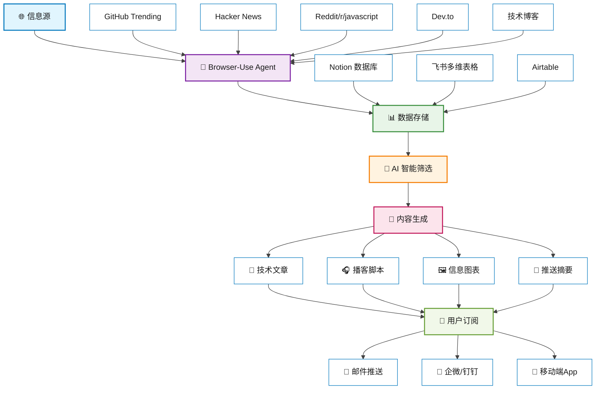

# 第二部分

## AI推动前端团队和个体能力升级

利用AI工具提升团队协作效率，建设智能化开发团队

---
layout: center
class: text-left
---

# 💬 开放讨论

  
  <h1 class="text-4xl font-bold text-gray-800 dark:text-white">
    你们团队平时是怎么获取最新前端资讯的？
  </h1>

---
layout: default
---

# 🤖 AI Agent 知识获取解决方案

<!--
这个页面展示了完整的 AI Agent 知识获取解决方案：

1. 信息源覆盖：
   - GitHub Trending：最新开源项目和趋势
   - Hacker News：技术讨论和新闻
   - Reddit：社区讨论和经验分享
   - Dev.to：开发者博客和教程
   - 各大技术博客：深度技术文章

2. 技术实现：
   - Browser-Use：模拟真实浏览器，突破反爬限制
   - 多平台存储：Notion、飞书、Airtable 等
   - AI 智能处理：内容理解、分类、评分
   - 多格式输出：文章、播客、图表、摘要

3. 用户体验：
   - 个性化订阅：根据兴趣和技术栈定制
   - 多渠道推送：邮件、企微、钉钉、App
   - 实时更新：重要资讯即时通知

4. 商业价值：
   - 效率提升：自动化替代人工筛选
   - 质量保证：AI 评估确保内容价值
   - 知识管理：结构化存储便于检索
-->

---
layout: default
---

# 传统团队 vs AI+ 团队

  <h3 class="text-xl font-bold text-red-700 mb-6">🔴 传统团队痛点</h3>
  
  <ul class="text-lg space-y-3 text-red-600">
    <li>• 重复性工作占用大量时间</li>
    <li>• 代码审查周期长，反馈滞后</li>
    <li>• 新技术学习成本高</li>
    <li>• 文档维护困难，更新不及时</li>
  </ul>

  <h3 class="text-xl font-bold text-green-700 mb-6">🟢 AI+ 团队优势</h3>
  
  <ul class="text-lg space-y-3 text-green-600">
    <li>• AI 自动化重复性任务</li>
    <li>• 智能代码审查，实时反馈</li>
    <li>• AI 辅助快速学习新技术</li>
    <li>• 自动生成和维护文档</li>
  </ul>

  

    🎯 核心转变：从人工驱动到 AI 增强的智能团队
  

---
layout: default
---

# AI工具生态全景

  <h3 class="text-xl font-bold mb-4">💻 代码生成与辅助</h3>
  

    <ColorCard title="GitHub Copilot" description="智能代码补全" color="blue" centered />
    <ColorCard title="Cursor / Trae" description="AI驱动编辑器" color="green" centered />
    <ColorCard title="Bolt.new" description="CodeMate 智能助理" color="purple" centered />
  

  <h3 class="text-xl font-bold mb-4">🔍 代码审查与质量</h3>
  

    <ColorCard title="DeepCode" description="智能代码分析" color="orange" centered />
    <ColorCard title="SonarQube" description="代码质量检测" color="red" centered />
    <ColorCard title="CodeGuru" description="性能优化建议" color="teal" centered />
  

  <h3 class="text-xl font-bold mb-4">📚 文档与测试</h3>
  

    <ColorCard title="Mintlify" description="自动文档生成" color="yellow" centered />
    <ColorCard title="Testim" description="智能测试生成" color="pink" centered />
    <ColorCard title="Diffblue" description="单元测试自动化" color="indigo" centered />
  

---
layout: default
---

# 💬 开放讨论

  
  <h1 class="text-4xl font-bold text-gray-800 dark:text-white">
    你是如何使用 AI Coding 工具的？
  </h1>

---
layout: default
---

# Vibe Coding：AI 驱动的编程新体验

  
🎵

  
让编程像音乐一样流畅自然

  <h3 class="text-xl font-bold text-purple-700 mb-4">🎯 核心理念</h3>
  <ul class="space-y-2 text-purple-600">
    <li>• 编程应该是直觉的、流畅的</li>
    <li>• AI 理解开发者的意图和节奏</li>
    <li>• 代码生成与思维同步</li>
    <li>• 减少认知负担，专注创造</li>
  </ul>

  <h3 class="text-xl font-bold text-green-700 mb-4">✨ 独特优势</h3>
  <ul class="space-y-2 text-green-600">
    <li>• 上下文感知的智能补全</li>
    <li>• 自然语言到代码的无缝转换</li>
    <li>• 实时代码质量优化建议</li>
    <li>• 个性化的编程风格学习</li>
  </ul>

---
layout: default
---

# Vibe Coding 工作流程

<!-- 左栏：工作流程卡片 -->

  
1

  

    <h4 class="font-bold text-blue-700 mb-0.5 text-sm">💭 思维捕捉</h4>
    
AI 实时理解开发者的编程意图和上下文

  

  
2

  

    <h4 class="font-bold text-green-700 mb-0.5 text-sm">🎯 智能预测</h4>
    
基于代码模式和开发习惯，预测下一步操作

  

  
3

  

    <h4 class="font-bold text-purple-700 mb-0.5 text-sm">⚡ 流畅生成</h4>
    
无缝生成高质量代码，保持编程节奏

  

  
4

  

    <h4 class="font-bold text-orange-700 mb-0.5 text-sm">🔄 持续优化</h4>
    
学习反馈，不断改进代码质量和开发体验

  

<!-- 右栏：及时反馈 -->

  <h2 class="text-2xl font-bold text-gray-800 dark:text-white mb-6">✨ 及时反馈 & 有效指导</h2>
  

    
  

---
layout: default
---

# 🛠️ AI 工具最佳实践

<!-- Cursor 最佳实践 -->
  

    <h2 class="text-xl font-bold text-blue-600 dark:text-blue-400 mb-4">🎯 Cursor Rules</h2>  
  

    

      

      项目规范定义
    

    

      

      代码风格约束
    

    

      

      上下文记忆
    

  

<!-- Trae 最佳实践 -->
  

    <h2 class="text-xl font-bold text-green-600 dark:text-green-400 mb-4">🤖 Trae 智能体</h2>  
  

    

      

      project_rules.md
    

    

      

      memory_bank/*
    

    

      

      持续上下文
    

  

  

    💡 核心：让 AI 理解你的项目规范和开发习惯
  

---
layout: default
---

# 个体能力升级策略

  <h3 class="text-xl font-bold mb-4 text-blue-600 dark:text-blue-400">🧠 认知能力提升</h3>
  

    

      
提示工程思维

      
学会与AI有效沟通，精准表达需求

    

    

      
系统性思考

      
从全局视角设计AI辅助的工作流程

    

    

      
持续学习

      
跟进AI技术发展，更新知识体系

    

  

  <h3 class="text-xl font-bold mb-4 text-green-600 dark:text-green-400">🛠️ 技术能力强化</h3>
  

    

      
AI工具精通

      
深度掌握各类AI开发工具的使用

    

    

      
代码质量意识

      
利用AI提升代码质量和可维护性

    

    

      
创新实践

      
探索AI在前端开发中的新应用

    

  

---
layout: center
class: text-center
---

# 小结

  
  

    

      🛠️
      <h4 class="text-lg font-bold text-blue-800 dark:text-blue-200">AI工具生态</h4>
    

    

       掌握了AI编程助手、代码生成、测试自动化等工具的选择与应用策略
     

  

  

    

      ⚡
      <h4 class="text-lg font-bold text-green-800 dark:text-green-200">Vibe Coding</h4>
    

    

       了解了思维捕捉、智能预测、流畅生成、持续优化的AI编程工作流程
     

  

  

    

      🎯
      <h4 class="text-lg font-bold text-purple-800 dark:text-purple-200">最佳实践</h4>
    

    

        掌握了Cursor Rules和Trae智能体的配置与使用技巧
      

  

  

    

      🚀
      <h4 class="text-lg font-bold text-orange-800 dark:text-orange-200">能力升级</h4>
    

    

        制定了认知能力提升和技术能力强化的个体发展路径
      

  

  <h3 class="text-xl font-bold mb-2 flex items-center justify-center">
    🎯
    下一步：AI 应用开发的最佳实践
  </h3>
  
了解 AI 应用开发的核心流程和最佳实践，澄清一些误区

